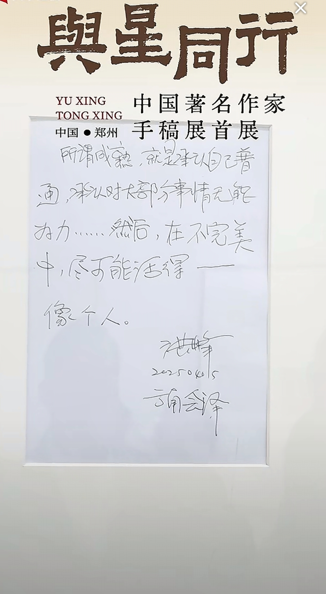

>But something happens when you add up small changes none of which matter. The total matters, even if none of the parts did. You look up one day and the place you live has become a different place. Not better, not worse. Different. And you realise you did not choose any of the changes. They happened while you were looking the other way, and now they are your life.

变化一切在变。  
变化在发生，不会询问你接受与否。  
AI来了之后一部分程序员和搞音乐的工作变得不重要了。  
超市也倒闭了。
跳江的
30多发现自己没有什么用的焦虑  
这个病入膏肓的社会
没有人去治疗  
谁的错我不清楚但是不是你的错
可能是时代的错美国人的错关税的错
天气的错

一切都是命  
没有人可以托举的  
建议也许应该尽早有个兜底的技能/手段  
技能单一生存在人口大国可能问题大大的。

哈哈哈以前不怎么信命运
后来慢慢感觉就是命运
能力不那么重要  
家庭天赋的更重要  
想摆脱工具人真的是需要高人指点扶持。  
有些发展的套路经济的门路平时也接触不到。  

这个时代发展太快，
被金融信用卡房子掏空了
被工作耗尽了  
一个残缺的人姑且自称还是人吧  
也许注定没有什么好结果
起点和时代决定的。
承认承受现实把。

